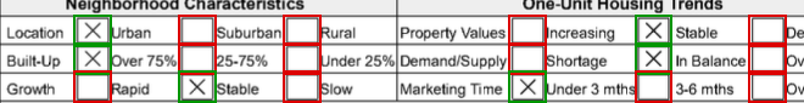

# Checkbox detection API

An HTTP service with one endpoint. Give it a document image or a PDF and it
reports where the checkboxes are and which ones are marked.

```text
POST /detect     multipart/form-data, file field "image"
```

The code is also on GitHub at
**https://github.com/reyesdiego/PDFCheckScanner**. That copy has the full
commit history, renders this README and `docs/PIPELINE.md` with their
figures, and always has the latest version; a zip is a snapshot of one commit.

## Start it

Nothing to install but Docker — the image brings its own OpenCV and poppler,
so none of the local setup further down applies.

```sh
docker compose up --build
```

That is the whole thing: it builds the image, starts the service, and serves
on **http://localhost:8080**. Leave it in the foreground and stop it with
Ctrl-C, or run it detached and follow it:

```sh
docker compose up -d --build
docker compose logs -f
docker compose down
```

Then, from the repo root, in another shell:

```sh
curl -X POST localhost:8080/detect -F "image=@testdata/form.png"
```

That fixture is four checkboxes with the middle two marked, and the answer
says so and nothing else:

```json
{
  "boxes": [
    { "bbox": [40, 40, 68, 68], "is_checked": false },
    { "bbox": [140, 40, 168, 68], "is_checked": true },
    { "bbox": [240, 40, 268, 68], "is_checked": true },
    { "bbox": [340, 40, 368, 68], "is_checked": false }
  ]
}
```

More requests to try, including both PDF paths, are under
[Trying it out](#trying-it-out).

The same four commands are wrapped as `make up`, `make logs` and `make down`.

The container always listens on 8080; `PORT` moves the host side of the
mapping:

```sh
PORT=9000 docker compose up -d --build
curl -X POST localhost:9000/detect -F "image=@testdata/mixed.pdf"
```

Compose polls `/detect` with a GET until it answers 405, so `docker compose ps`
reports `healthy` only once the router is actually serving. The first build
takes a few minutes, mostly `apt-get`; later ones reuse the Go module and
build caches and take seconds.

### What is in the image

A two-stage build on Debian trixie, which packages OpenCV 4.10 and poppler, so
neither is compiled from source:

| stage | carries |
| --- | --- |
| builder | the Go toolchain, `libopencv-dev`, `pkg-config` |
| runtime | the OpenCV shared libraries, `poppler-utils` for `pdftoppm`, and the binary, running as a non-root user |

It comes out around a gigabyte, almost all of it OpenCV: gocv's root package
wraps every module, so the binary links all twelve of them. `.dockerignore`
keeps `testdata/` out of the build context, which also means the uncommitted
appraisal samples cannot reach an image.

The tests do not run in the container, and for day-to-day work the local
toolchain is faster to iterate with.

## How it works



Green is marked, red is not. A PDF carrying real AcroForm widgets is answered
from its own form fields; everything else is rasterized at 300 DPI and put
through a pixel detector that looks for **quadrilaterals, not square-ish
blobs**, because `D` and `o` are as square as a checkbox.

**[docs/PIPELINE.md](docs/PIPELINE.md) walks the whole thing through with
figures** — the binarized page, all 348 contours in one strip, what each gate
measures on a single box, and the before-and-after of the three bugs that real
appraisal pages exposed: a perfect square that fitted a pentagon, ruled cells
indistinguishable from checkboxes, and the letters of a section banner
reported as marked boxes.

Regenerate the figures with `make docs`; they are drawn by the detector itself
from committed fixtures, so they cannot drift from the code.

## Limitations

The detector is geometry and thresholds, not a trained model, and it has only
been checked against a handful of real pages. What it is known to get wrong:

- **Skewed pages lose boxes.** Boxes are assumed roughly axis-aligned and there
  is no deskew step, so photographed or crooked scans do poorly.
- **Small boxes are not found.** Below about 12px a checkbox and a letter look
  the same. Scan at 200-300 DPI; nothing warns you when an image is too coarse.
- **Boxes touching a table rule can be missed.** The border merges into the
  grid, and the box is found only by its empty interior, which a mark breaks
  up. On one sample page this hides about a third of the marked boxes.
- **Square table cells can be reported as checkboxes** when they are the same
  size and shape.
- **A pen stroke through a box loses it**, and so does a border broken worse
  than the samples' own damage.
- **Faint marks away from the centre**, such as light pencil, can read as
  unmarked.
- **`confidence` is a ranking, not a probability.** It separates real boxes
  from look-alikes well, but it is not calibrated, so there is no principled
  cutoff to filter on.
- **Accuracy is not measured.** There are no labelled pages, so the counts
  quoted here are regression floors checked by eye, not precision and recall.

Some inputs get a deliberate answer rather than an error:

| input | answer |
| --- | --- |
| an image that is more than 60% ink, e.g. an inverted scan | `200` with no boxes |
| a page with no checkboxes | `200` with no boxes |
| a PDF longer than 10 pages | boxes from the first 10; `image.pages` still counts all of them |
| a PDF page too large to render at 300 DPI | rendered smaller, with its boxes scaled back to 300 DPI coordinates |
| a PDF with at least one checkbox form field | answered from its fields alone; no page is scanned |

The last row matters for mixed documents: once a PDF has any checkbox field, a
checkbox that is only printed on a page, on that page or any other, is not
reported.

[WRITEUP.md](WRITEUP.md#known-limitations) has the full list with the cases
behind each one and what was tried, and
[docs/PIPELINE.md](docs/PIPELINE.md#what-it-still-gets-wrong) shows the main
failures with figures.

## Setup for local development

Go 1.27, plus two system dependencies:

```sh
brew install opencv@4 poppler

# opencv@4 is keg-only, so its opencv4.pc sits outside pkg-config's default
# search path. gocv's cgo directives ask for it by name, so without this
# symlink any build that has to compile gocv fails, and so does the IDE's own
# build, which does not inherit a run configuration's environment.
ln -sf /opt/homebrew/opt/opencv@4/lib/pkgconfig/opencv4.pc \
       /opt/homebrew/lib/pkgconfig/opencv4.pc
```

Homebrew's default `opencv` formula is 5.x, which gocv does not support; the
versioned `opencv@4` is required. `poppler` provides `pdftoppm`, which is only
needed for PDFs that have no form fields.

## Build and run

```sh
make run          # go run . -addr :8080
make run ADDR=:9000
make build        # -> bin/api
make test         # go test ./...
make smoke        # end-to-end checks with curl against a running server
make race         # go test -race ./...
make check        # fmt + vet + race
make fixtures     # regenerate testdata from testdata/gen_fixtures.py
make up           # docker compose up -d --build
make down         # docker compose down
make logs         # docker compose logs -f
```

Every target exports `PKG_CONFIG_PATH` itself, so `make` works even without the
symlink above. The only flag is `-addr`.

Run tests through `make test` or `go test ./...` — never `go test some_test.go`,
which compiles that one file and fails with `undefined: NewDetector`.

## Using it

```sh
curl -X POST localhost:8080/detect -F "image=@testdata/form.png"
```

```json
{
  "boxes": [
    { "bbox": [40, 40, 68, 68], "is_checked": false },
    { "bbox": [140, 40, 168, 68], "is_checked": true }
  ]
}
```

The answer is the question that was asked: where each checkbox is and whether
it is marked. Everything about *how* the answer was reached is explanation,
and explanation is opt-in — add `?detail=true`:

```sh
curl -X POST "localhost:8080/detect?detail=true" -F "image=@testdata/form.png"
```

```json
{
  "request_id": "host/AKAvIwek35-000001",
  "image": {
    "filename": "form.png",
    "content_type": "image/png",
    "size_bytes": 346,
    "width": 420,
    "height": 110
  },
  "method": "pixels",
  "boxes": [
    { "bbox": [40, 40, 68, 68], "is_checked": false, "confidence": 0.98 },
    { "bbox": [140, 40, 168, 68], "is_checked": true, "confidence": 0.98 }
  ]
}
```

A bare `?detail` does the same; any value that is not a boolean is not a
request for detail.

`bbox` is `[x1, y1, x2, y2]` in pixels from the image's top-left. The second
corner is **exclusive**: `width == x2 - x1`, so a 28px box at (40,40) is
`[40, 40, 68, 68]`.

Per box, beyond the two required fields:

| field | meaning | |
| --- | --- | --- |
| `page` | 1-based page of a PDF. Omitted for images. | always |
| `name` | The PDF's qualified form field name, e.g. `consent.marketing`. Omitted unless the answer came from form fields. | always |
| `confidence` | 0-1. Shape-fit score from the detector, or exactly `1` for a PDF that states its own answer. | `?detail=true` |

And under `?detail=true`, at the top level: `method` says where the answer came
from — `acroform` when read out of a PDF's own form fields, `pixels` when the
detector looked at the image — `image` describes the upload, and `request_id`
matches the server log. For PDFs, `image.pages` counts every page in the
document, even when only the first ten were scanned.

### Accepted uploads

JPEG, PNG, WebP, GIF and PDF. The type is decided by **sniffing the bytes**,
not by the client's declared `Content-Type`, so a shell script sent as
`image/png` is rejected.

For best results scan at 200-300 DPI. Below roughly 12px a checkbox and a
letter are both just blobs (see the writeup).

### Errors

| status | when |
| --- | --- |
| 400 | body is not `multipart/form-data`, or has no `image` file field |
| 413 | upload over 10 MiB, or an image over 24 million pixels |
| 415 | not a supported type, or the bytes are malformed |
| 422 | the PDF could not be read at all |
| 500 | the image decoded but could not be examined |
| 503 | a scanned PDF arrived but `pdftoppm` is not installed |
| 504 | the PDF took longer than the 30s request timeout |

Every error from `/detect` is JSON with a single `error` field saying what was
wrong:

```json
{ "error": "unsupported type \"text/plain\", want one of: application/pdf, image/gif, image/jpeg, image/png, image/webp" }
```

Only the router answers outside that shape: a method other than `POST` on
`/detect` is a 405 and any other path is a 404, both with no JSON body.

## Trying it out

Start the server (`make run`, or `make up` for the container), then:

```sh
# an image: 4 checkboxes, the middle two marked
curl -X POST localhost:8080/detect -F "image=@testdata/form.png"

# a real appraisal page: 48 checkboxes, 12 of them marked
curl -X POST localhost:8080/detect -F "image=@testdata/image2.png"

# a ~150 DPI scan with 16-17px boxes: at least 55 found
curl -X POST localhost:8080/detect -F "image=@testdata/image1.png"

# a landscape appraisal page with a lettered section banner
curl -X POST localhost:8080/detect -F "image=@testdata/image3.png"

# a dense page: at least 110 boxes, none of them banner letters
curl -X POST localhost:8080/detect -F "image=@testdata/image4.png"

# a PDF with real form fields: answered from the AcroForm, not the pixels
curl -X POST localhost:8080/detect -F "image=@testdata/form-fields.pdf"

# a flattened PDF: pdftoppm renders it and the detector runs
curl -X POST localhost:8080/detect -F "image=@testdata/scanned-form.pdf"

# a page of text and no checkboxes: the false-positive canary, expect []
curl -X POST localhost:8080/detect -F "image=@testdata/prose.pdf"
```

The field name must be `image`; anything else is a 400. Piping through `jq`
makes the answer easier to read, and these two are the ones worth looking at:

```sh
curl -s -X POST localhost:8080/detect -F "image=@testdata/mixed.pdf" \
  | jq '{total: (.boxes | length), checked: [.boxes[] | select(.is_checked)] | length}'
# { "total": 6, "checked": 3 }

curl -s -X POST "localhost:8080/detect?detail=true" -F "image=@testdata/form-fields.pdf" \
  | jq '.method, [.boxes[] | {name, is_checked}]'
# "acroform", with the PDF's own field names
```

### Asserting from the shell

The curl calls above show you the answer; `scripts/smoke.sh` checks it. It
makes the same requests `api.http` does and asserts the same things, so it
needs no IDE and can gate a deploy — it exits non-zero if anything is off.

```sh
make run          # or make up, in another shell
make smoke        # or: scripts/smoke.sh
```

```text
== the shape of the answer
ok   default response has only boxes
ok   a box has only bbox and is_checked
ok   ?detail=true adds the metadata
...
== the error paths
ok   wrong field name -> 400
ok   GET is not routed -> 405

22 passed, 0 failed
```

A failure prints what it wanted and what it got:

```text
FAIL image2.png: 48 boxes, 12 of them marked
       want: 48 12
        got: 51 12
```

It needs `curl` and `jq`, runs from the repository root, and takes `HOST` to
point somewhere else:

```sh
HOST=http://localhost:9000 scripts/smoke.sh
```

The single checks it is built from are worth knowing on their own, because
they are how you assert one thing by hand:

```sh
# how many boxes, how many marked
curl -s -X POST localhost:8080/detect -F "image=@testdata/image2.png" \
  | jq '"\(.boxes | length) boxes, \([.boxes[] | select(.is_checked)] | length) marked"'

# the marked pattern, in reading order
curl -s -X POST localhost:8080/detect -F "image=@testdata/form.png" \
  | jq -r '[.boxes[].is_checked | tostring] | join(",")'

# just the status code, for the error paths
curl -s -o /dev/null -w '%{http_code}\n' -X POST localhost:8080/detect \
  -F "photo=@testdata/form.png"
```

### From the IDE

`api.http` holds the same requests with assertions attached, runnable from
GoLand with the ▶ icon in the gutter (⌘⏎ / Ctrl+Enter). The `> `
block after a request is a **response handler**: the IDE runs it when the
response arrives, and `client.test` / `client.assert` report into the
**Tests** tab of the run window, next to Response and Headers — not into the
response body, which is why the assertions look invisible if you only read
the response. Response handlers are a JetBrains feature; the VS Code REST
Client will send these requests but silently ignore the assertions.

It covers every committed fixture — both PDF paths, WebP decoding, the prose
canary — and the error paths: wrong field name, a JSON body, a file that is
not an image, and `GET` on a POST-only route. The assertion blocks check the
status, the `method`, and the exact box and checked counts, so running the
file top to bottom is a quick end-to-end check of the service.

## Layout

| file | |
| --- | --- |
| `main.go` | chi router, middleware, flags, graceful shutdown |
| `detect.go` | the endpoint: multipart handling, sniffing, limits, response shape |
| `detector.go` | the image detector (OpenCV via gocv) |
| `pdf.go` | PDF handling: AcroForm fast path, pdftoppm fallback, page geometry |
| `testdata/` | fixtures, all generated by `gen_fixtures.py`; see `testdata/README.md` |
| `api.http` | requests for the endpoint, runnable from the IDE with assertions |
| `Dockerfile`, `compose.yaml` | the containerised build: OpenCV and poppler from Debian trixie |

`WRITEUP.md` covers the approach, the tradeoffs and the known limitations.
