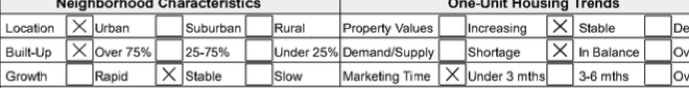
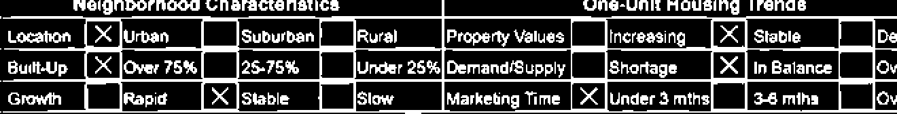
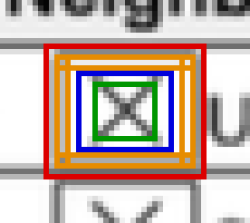
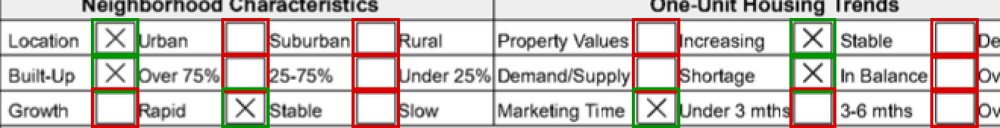
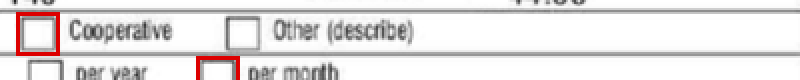
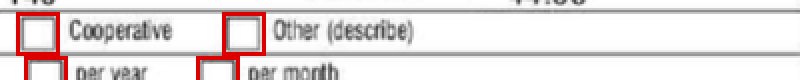
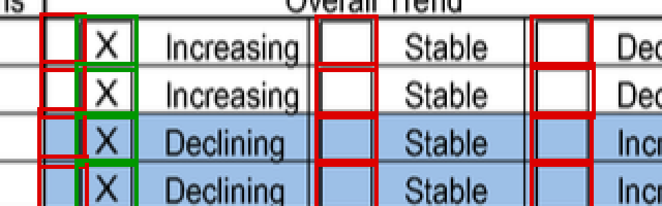
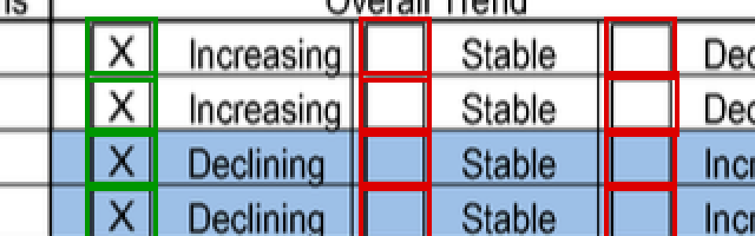
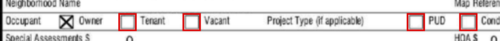
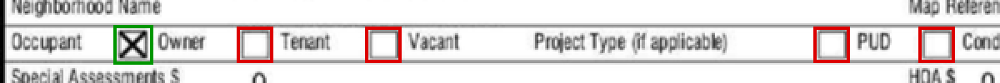

# How this service finds checkboxes

One document covering the whole approach: how an upload becomes a list of
checkboxes, why the detector is built on OpenCV 4, how each stage works, and
the edge cases that shaped it. The figures are drawn by the detector itself
(`make docs`). For the step-by-step walkthrough with pictures see
[PIPELINE.md](PIPELINE.md), and for the tradeoffs and next steps see
[WRITEUP.md](../WRITEUP.md).

## Contents

1. [The problem](#1-the-problem)
2. [Two paths: ask the PDF, or look at the pixels](#2-two-paths-ask-the-pdf-or-look-at-the-pixels)
3. [Why OpenCV 4](#3-why-opencv-4)
4. [How the pixel detector works](#4-how-the-pixel-detector-works)
5. [Edge cases, and what each one changed](#5-edge-cases-and-what-each-one-changed)
6. [Edge cases at the API boundary](#6-edge-cases-at-the-api-boundary)
7. [What it still gets wrong](#7-what-it-still-gets-wrong)
8. [Parameter reference](#8-parameter-reference)

---

## 1. The problem

The input is a form, typically a page of an appraisal report, uploaded as an
image (PNG, JPEG, WebP, GIF) or a PDF. The output is every checkbox on it, as a
bounding box, and whether it is marked:

```json
{ "boxes": [ { "bbox": [140, 40, 168, 68], "is_checked": true } ] }
```

Finding squares sounds easy. It isn't, because a form is full of things that
look like checkboxes:

- **Letters.** `D`, `o`, `O`, `0`, `B` are as square as a checkbox, and their
  counters (the enclosed holes) are as empty as an unticked box.
- **Table cells.** A ruled cell is a rectangle with a full border and a clean
  interior. By shape, it *is* a checkbox.
- **Boxes stuck to rules.** A checkbox whose border touches a table line
  stops being a separate shape. It becomes part of the grid.
- **The marks themselves.** A bold X sticks out past the border, a scratchy
  one leaves ink only in the corners, and a scan softens everything.

The job is less "find the squares" than "reject the hundreds of shapes that
aren't checkboxes without losing the few that are". One crop in PIPELINE.md
has 348 contours and 12 checkboxes.

## 2. Two paths: ask the PDF, or look at the pixels

`POST /detect` sniffs the upload's real type from its bytes, then chooses a
path (`detect.go`, `pdf.go`):

```text
upload ──► image? ─────────────────────────────────────► pixel detector
       └─► PDF ──► has AcroForm checkbox fields?
                     ├─ yes, all readable ──► read the fields  (method: "acroform")
                     └─ no / unreadable ────► pdftoppm @300 DPI ──► pixel detector
```

### Path A: the PDF already has the answer

A fillable PDF stores each checkbox's state in its own form fields, so there
is nothing to guess. `acroFormCheckboxes` reads the widgets with **pdfcpu**:

- It keeps `/Btn` fields and drops radio buttons and push buttons using their
  field flags (bits 15 and 16).
- It follows the `/Parent` chain, because a widget usually inherits its
  type, flags, value and name from its parent field.
- It prefers the widget's `/AS` (appearance state) over an inherited `/V`
  when they disagree, since `/AS` is what's actually drawn on the page.
- It converts `/Rect` from PDF points (72/inch, bottom-left origin) into
  pixels at 300 DPI with a top-left origin, and applies `/Rotate`, because
  `pdftoppm` honours rotation. Both paths then use the same coordinates.
- It returns the qualified field name (`form.section.question`), which says
  which question each answer belongs to. No pixel detector can recover that.

Confidence is `1` on this path.

### Path B: pixels

Images, and PDFs that are scanned or flattened (most real appraisal reports),
contain no fields to read. PDFs are rendered with `pdftoppm` at **300 DPI**
(section 5.7 explains why 300), up to 10 pages, and every page goes through
the OpenCV detector. Nearly all of the interesting work is in this path.

## 3. Why OpenCV 4

### The first version didn't use it, and failed

The first commit (`c06975f`) had a detector written in plain Go:

1. Sauvola local thresholding
2. Connected-component labelling of the ink
3. A score for each blob on how much it looked like a hollow square: aspect
   ratio, how much of the bounding box edge was covered, how empty the
   middle was

It passed every test I had written. On the challenge's own description PDF
it reported **2,309 checkboxes**, including **167 on page 1**, which is
prose with no checkboxes on it. Drawing the detections on the page showed
why: it was boxing letters, `B a n o e D H`.

`D` is the case that shows the problem. It has a straight left stem, straight
top and bottom strokes, a right curve that still reaches the edge of its
bounding box, and a counter measuring **0.01 interior ink**, the same as an
empty checkbox. By every measure a blob can offer, `D` *is* a checkbox.
Tightening the thresholds enough to exclude it also excluded real boxes.

### What was missing: the shape itself

The thing that separates a checkbox from a `D` is that **a checkbox is a
quadrilateral and a letter isn't**. Measuring that takes three things:

| need | OpenCV function |
| --- | --- |
| the outline of each shape, holes included | `findContours` with `RETR_LIST` |
| a hull that ignores spikes and nicks | `convexHull` |
| "how many corners does this outline really have?" | `approxPolyDP` (Douglas-Peucker) |

Around those it adds fast, well-tested building blocks for everything else
the detector does: `adaptiveThreshold`, Otsu thresholding, `GaussianBlur`,
morphological opening and dilation, `reduce`, `countNonZero`, `contourArea`,
`boundingRect`.

Contour tracing with correct hole handling, convex hulls and polygon
simplification can all be written by hand, but doing them well means a lot
of subtle code, and the hand-written attempt had just shown how easily that
goes wrong. Switching to contours plus `approxPolyDP` (`f3ec158`) changed the
result from this:

| | prose pages 1 / 2 / 7 | form pages 3 / 4 / 5 / 6 |
| --- | --- | --- |
| hand-written blob geometry | **167 / 82 / 195** | 17 / 83 / 24 / 79 |
| OpenCV contours, hull fit | **0 / 0 / 0** | 133 / 41 / 56 / 78 |

False positives on prose went to zero, and the form pages kept or gained
boxes.

### Why OpenCV specifically, and why version 4

- **Classical CV, not a trained model.** No labelled data came with the
  task. A geometric detector is deterministic, fast (37 ms on a 3.8 MP page)
  and needs no GPU. It also explains itself: every rejection traces back to
  a named threshold with a measurement behind it. With labels, a model would
  be the right next step (see WRITEUP.md).
- **OpenCV is the standard library for this kind of work.** The contour and
  polygon functions are decades old, widely used and documented, and they
  behave the same way you'd see in any tutorial or Stack Overflow answer.
- **gocv** is the maintained Go binding. It targets the **OpenCV 4.x** API,
  and 4.x is what current package managers ship: Homebrew's `opencv@4`, and
  Debian trixie's `libopencv-dev` 4.10. The Docker image installs the distro
  package instead of building OpenCV from source, which takes the build from
  hours to minutes.

### What it costs

- **cgo.** The binary isn't a static pure-Go executable. It needs OpenCV's
  shared libraries at runtime.
- **Image size.** About 1 GB. gocv's root package wraps every OpenCV module,
  so the binary links them all, even though the detector only thresholds and
  traces contours.
- **Manual memory management.** A `gocv.Mat` is C++ heap memory the Go GC
  doesn't see, so every Mat is `Close()`d explicitly. Error paths return the
  zero `Mat{}`, which owns nothing, so a caller can't leak one.
- **Local setup.** Homebrew's `opencv@4` is keg-only, so its `.pc` file has
  to be symlinked for `pkg-config` (see the README).

The drop from 167 false positives on a prose page to 0 was worth those costs.

## 4. How the pixel detector works

All of this is in `detector.go`, `Detector.Detect`. Every threshold is a field
on `Detector`, not a constant, so tests and the doc figures can turn one gate
off and show what it does.



### Step 1: flatten to grayscale

`toGray` draws the image onto a **white** canvas before converting it.
Without that, a transparent PNG's clear pixels read as black, and the whole
page becomes ink.

### Step 2: binarize (decide what counts as ink)



A scan has no true black or white, and a photographed page is lit unevenly.
The ink mask combines two tests with a logical OR:

- **Gaussian adaptive threshold.** A pixel is ink if it is darker than its
  own neighbourhood by a margin `C`. The neighbourhood is about 1/25 of the
  short edge, clamped to 15-101 px and odd, so it can hold a checkbox and
  some paper around it.
- **An absolute dark floor (grey < 90).** Adaptive thresholding hollows out
  solid areas, because the middle of a filled blob has no local contrast. A
  filled-in box would turn into a ring, and then into a fake *empty* box.

The margin `C` is **measured, not fixed**. `noiseSigma` estimates the paper
grain as the mean absolute difference between the page and a blurred copy of
it, and `C = 2.5 × noise`, clamped to 10-30 grey levels (section 5.9 explains
why).

The detector keeps **three masks**, because no single binarization answers
every question:

| mask | used for |
| --- | --- |
| `shape` (adaptive, noise-scaled margin) | contours and geometry |
| `ink` (adaptive, full margin 30) | deciding whether a box is marked |
| `global` (Otsu) | a second opinion when a border looks incomplete |

If more than 60% of the `shape` mask is ink (an inverted or black page), the
detector returns no boxes rather than guessing.

### Step 3: find every contour, holes included


`FindContours` with **`RetrievalList`** returns a flat list of every outline,
**including holes**. That matters: an empty checkbox encloses a hole, and the
hole is a contour in its own right. When the box's border is welded to a
table rule and its outer contour disappears into the grid, the box is still
found by its hole.

### Step 4: fit a polygon to the convex hull

For each contour:

1. Take its **convex hull**.
2. Simplify the hull with `approxPolyDP`, at a tolerance of
   `max(2% of perimeter, 2px)`.
3. Keep it only if it has **4 corners**, or **5 corners with rectangularity
   ≥ 0.90** (section 5.3).

The fit uses the hull and not the raw contour, because real marks overflow
their boxes (section 5.2).

### Step 5: the gates



A candidate has to pass all of these:

| gate | test | what it rejects |
| --- | --- | --- |
| size | 12 px ≤ side ≤ max(120 px, 6% of short edge), and ≤ 90% of short edge | specks, letters too small to measure, page frames |
| squareness | `min(w,h)/max(w,h)` ≥ 0.6 | long thin rectangles |
| rectangularity | hull area / bbox area ≥ 0.80 | triangles, curves, round letters |
| edge coverage | each of the 4 sides has ink along ≥ 75% of its length (weakest side counts) | `H`, `E`, `N`, whose hulls are rectangular but whose top/bottom are open |
| global fallback | if edge coverage fails on `shape`, try again on the Otsu mask | (rescues boxes whose border a heavy X "ate") |
| solid interior | central ink ≤ 0.85 | filled blobs and glyphs |
| on paper | ≤ 60% ink in a band around the box | letters knocked out of a black banner |
| confidence | blended score ≥ 0.87 | shapes that are mediocre on every measure at once |

Confidence is
`0.35·rectangularity + 0.25·edge coverage + 0.20·squareness + 0.20·margin`,
where margin is how far the interior ink is from the marked/unmarked cutoff
(1 if marked). It's used for ranking and isn't a calibrated probability.

### Step 6: marked or not

The detector measures ink in **two windows inside the box**, both inset past
the **measured** border thickness (`strokeWidth` reads the run of ink from the
midpoint of each side, where a mark is least likely to be):

- **central window** (25% inset each side): marked if ink ≥ **0.10**
- **wide window** (15% inset): marked if ink ≥ **0.13**

A box is marked if **either** window says so. Section 5.5 explains why.

### Step 7: a second pass with the table rules erased

`withoutRules` opens the mask with a horizontal and a vertical line kernel,
each longer than the largest allowed box. That keeps only the rules. It
dilates them by 1 px to catch ragged edges, subtracts them from the mask, and
runs steps 3-6 again. Anything this pass finds is **measured on the original
mask**, and it only **fills gaps**: where the first pass already found a box,
the first pass's rectangle wins (section 5.8).

### Step 8: clean up

1. **Dedupe.** A box's outline and its own hole are the same box seen
   twice. Candidates with IoU > 0.3, or that nest near-concentrically (gap
   ≤ 25% on every side), collapse into the larger one. Containment alone
   isn't enough, because a response cell can legitimately contain checkboxes.
2. **Size prior.** On a page with ≥ 10 candidates, anything more than 15%
   narrower/shorter or 25% wider/taller than the page's median box is dropped
   (section 5.6).
3. **Cap.** At most 500 detections, keeping the highest-confidence ones.
4. **Reading order.** Candidates are grouped into rows by median box height,
   then sorted left to right, so a few pixels of skew don't scramble a row.



## 5. Edge cases, and what each one changed

I didn't design any of these gates up front. Each one exists because a real
page broke the previous version.

### 5.1 Letters reported as checkboxes

**Symptom:** 167 checkboxes on a page of prose.
**Cause:** blob geometry can't tell `D` from a box.
**Fix:** require a quadrilateral via `approxPolyDP`. The tolerance mattered
more than any other single parameter:

| tolerance | false positives, 3 prose pages | detections, 4 form pages |
| --- | --- | --- |
| 5% of perimeter | 14 | 305 |
| **2%**, rectangularity 0.85 | **0** | **283** |
| 2%, rectangularity 0.90 | 0 | 259 |

At 5% the counter of a bold `B` or `D` fits a quad. At 2% it doesn't. Going
tighter started losing real boxes.

**Test lesson:** this bug survived because every fixture was rectangles on
blank paper, with no text anywhere. `testdata/prose.pdf` and `mixed.pdf` now
contain real Helvetica rendered by `pdftoppm`. Both fail when run against the
old tolerance.

### 5.2 A bold X that pokes out of its box

**Symptom:** a perfect 37×37 box rejected for having **7 corners**.
**Cause:** the raw outline detours around each spike of the X.
**Fix:** fit the polygon to the **convex hull**. A hull ignores spikes and
nicks, and the hull of a round letter still isn't a quad, so the
discrimination from 5.1 survives. The same fix handled a **border with a
cut in it**: a broken ring encloses no area, so its raw contour doubles back
on itself and scored rectangularity 0.10, while its hull scores about 0.8.

The hull brought a new problem: blocky capitals like `H`, `E` and `N` have
rectangular hulls. That's why the **edge coverage** gate exists. It requires
ink along each side, and the open top of an `H` fails it.

### 5.3 A perfect square fitted as a pentagon

**Symptom:** a page scanned at about 150 DPI reported 39 of its ~118 boxes.
The dropped ones scored squareness 1.00, rectangularity 0.87 and edge
coverage 1.00, and had **5 corners**.
**Cause:** 2% of a 16 px box's perimeter is 1.3 px. A rasterized edge wanders
about 1 px, so the tolerance was finer than the image's own precision, and a
rounded corner became an extra vertex.
**Fix:** a **2 px floor** on the tolerance, plus accepting a 5-cornered hull
when rectangularity ≥ 0.90. A curve can't reach 0.90, since rectangularity is
exactly what a `D` fails. Simply raising the floor to 3 px brought the prose
false positives back.
**Result:** 46 → 69 detections on that page, with prose still at 0.




### 5.4 Global thresholding drowns the page

**Symptom:** with Otsu, every box vanished on a sparse page.
**Cause:** with ink covering under 1% of the page, the split that maximizes
between-class variance separates light paper noise from dark paper noise
(169 vs 153 on one page), not ink from paper.
**Fix:** local (adaptive) thresholding, with two adjustments:

- **A large margin (30) and no pre-blur.** At a small margin, **37%** of a
  noisy page's paper came out as ink. Blurring first also fixes that, but it
  widens every stroke and makes every reported box 1 px too large on each
  side.
- **A dark floor, combined with OR,** so solid marks stay solid (step 2).

Otsu came back later in a narrow role (5.10).

### 5.5 Marks that sit in the wrong place

**Symptom 1:** thin cross marks on a 28 px box read as unmarked. The
interior measured 0.135 against a 0.15 cutoff.
**Cause:** the border's anti-aliasing bleeds inward and blurs the numbers.
**Fix:** measure only the **central half**. Across a real form it separates
cleanly: 0.00 for 38 empty boxes, 0.30-0.40 for 12 marked ones. The cutoff
is 0.10, in the middle of a wide gap.

**Symptom 2:** a worn X leaves blobs in the four corners and almost nothing in
the middle. One box read **0.066** in the full page and **0.114** in a crop of
the same page, landing on opposite sides of the threshold.
**Fix:** a second, **wider window** (15% inset) with a cutoff of 0.13. It
read the same box at 0.153 and 0.156, which is stable. Across 358 detections
in two documents, empty boxes never went above 0.12 in this window.

**Symptom 3:** on a box near 12 px, a 3 px border is more than 15% of the
side, so the wide window *contained the border* and read an empty box at
0.36 ink, i.e. as marked.
**Fix:** inset both windows past the **measured** stroke width, not just a
fixed fraction.

### 5.6 Table cells that look exactly like checkboxes

**Symptom:** all 13 narrow ruled cells next to the boxes on one page were
reported.
**Cause:** a cell has a full border and a clean interior. Squareness didn't
separate them (the ranges overlapped between pages), and neither did the ink
around them.
**Fix:** a **size prior**. A printed form draws every checkbox at the same
size, so on a page with ≥ 10 candidates the median says what a box measures
there. The tolerance is deliberately **lopsided: 15% below, 25% above**,
because a mark overflows its box, so a measured box can be larger than the
printed one but never smaller. On one page the four widest boxes (33-35 px
against a median of 29) were exactly the four marked ones.
**Result:** 61 → 48, exactly the number of checkboxes on the page.




### 5.7 Resolution: empty boxes reading as marked

**Symptom:** an early version reported 158 of 167 boxes as checked.
**Cause:** at 200 DPI the boxes were 11-13 px, and anti-aliasing filled their
interiors to 0.55-0.78 ink.
**Fix:** rasterize PDFs at **300 DPI**, where the same boxes are 17-19 px with
interiors of 0.01-0.11. `MinSide = 12` is where the detector stops trying:
below that a box and a letter are both just blobs, and reporting nothing is
more honest than guessing.

### 5.8 Marked boxes welded to a table rule

**Symptom:** on the Occupant row, every empty box was found, and the crossed
one, Owner, wasn't.
**Cause:** Owner's bottom edge touches the rule below, so its outline belongs
to the table's contour (1081×1648 px). An empty box in that position is still
found by its hole (step 3), but an **X splits the hole into four triangles**,
and none of them is a box. The boxes most likely to be lost this way are the
marked ones, which are the ones that matter most.
**Fix:** the rule-free second pass (step 7). Two details mattered:

- **Dilate the rules by 1 px before erasing them.** A scanned rule is ragged,
  and a 68 px leftover stayed attached to Owner's corner and made it five
  times too wide.
- **Only fill gaps.** The second pass sees a box with one edge erased, so its
  rectangle can be a pixel short. Where the first pass found the box, its
  rectangle wins.

**Result:** `image1.png` 69 → 78, all nine new boxes marked. Every earlier
detection stayed the same, and prose stayed at 0.




### 5.9 Soft scans whose borders disappear

**Symptom:** a row of nine checkboxes on a soft, low-contrast scan reported
none.
**Cause:** the fixed margin of 30 grey levels was larger than the contrast
between a grey border and the paper. Borders came out dashed, and edge
coverage fell to 0.21.
**Fix:** make the margin `2.5 × measured noise`, clamped to 10-30. Grainy
scans measure 10-18 levels of noise and keep the full 30. Soft scans measure
about 4 and get a margin they can clear.

That fix caused a new problem: at a soft margin, the blurred fringe of a
border becomes ink and fills a small box's interior, so the box reads as
marked. That's why there are **two masks**. Shapes come from the soft mask,
and marks are always judged on the strict one. On a grainy page the two masks
are identical.

### 5.10 A heavy X eats its own border

**Symptom:** a marked box scored 0.59 edge coverage while the empty box next
to it scored 0.97.
**Cause:** adaptive thresholding compares each pixel with its neighbours.
Heavy ink inside the box raises the local mean, and thin border pixels next
to it lose their contrast.
**Fix:** when edge coverage fails on the adaptive mask, ask the **global
Otsu mask** before rejecting the box. Otsu can't handle uneven lighting, but
it doesn't care what's next to what, which is the opposite weakness.

### 5.11 Letters knocked out of a black banner

**Symptom:** ten "checkboxes" on one page, all *marked*, which were the
counters of white `E` and `N` letters in the vertical section labels
("SUBJECT", "CONTRACT") down the margin.
**Fix:** a checkbox sits on paper. If the band around a candidate is more
than 60% ink, it isn't a checkbox. Real boxes measure 0.07-0.26 there, and
banner letters measure close to 1.

On current fixtures the size prior (5.6) also catches these. The check stays
because it works on pages with fewer than 10 boxes, where the size prior
switches off.

### 5.12 A hand-drawn square that passes every gate by a hair

**Symptom:** a hand-drawn square scored hull 0.81 (gate 0.80) and coverage
0.76 (gate 0.75).
**Cause:** real borderline boxes are borderline on **one** measure each. The
cut-border box scores hull 0.80 but coverage 0.91, and the small box scores
coverage 0.77 but hull 0.91. No single threshold removes the hand-drawn
square without removing them too.
**Fix:** a **minimum blended confidence of 0.87**. The hand-drawn square
scores 0.83, the borderline real boxes 0.90-0.91, and printed boxes 0.98. It
also removed seven letter false positives from words like "cond" and
"average".

### 5.13 Scale sensitivity

**Symptom:** a marked box was found in a crop and missed in the full page.
**Cause:** edge coverage is harsher on smaller boxes. At 26 px each missing
pixel costs 1/26 of a side, compared with 1/33 at 33 px, so the same box
scored 0.88 in the crop and 0.77 in the page.
**Fix:** the coverage gate went from 0.80 to **0.75**. Prose stayed at 0, and
the form pages went from 283 to 315.

### 5.14 Size bounds that break at the extremes

- A purely **absolute** 120 px cap rejected every box on a 600 DPI scan
  (about 133 px each).
- A purely **relative** cap rejected every box in a 1954×58 row crop, where
  50% of the short edge was 29 px and the boxes were 33 px.
- **Fix:** cap at `max(120 px, 6% of short edge)`, never more than 90% of
  the short edge.

### 5.15 Duplicates vs. boxes inside boxes

A box's outline and its hole are found as two candidates, so they have to be
deduplicated. "Drop anything contained in a larger box" would also delete
every checkbox inside a ruled response cell. **Fix:** treat two candidates as
duplicates only if they are **near-concentric**, with a gap on every side no
wider than a border stroke.

## 6. Edge cases at the API boundary

These aren't about detection, but they decide what the detector receives:

| input | behaviour |
| --- | --- |
| client lies about Content-Type | type comes from sniffing the bytes; the declared type is ignored |
| file > 10 MiB | `413` |
| image > 24 MP (configurable with `-max-pixels` / `MAX_PIXELS`) | `413`, checked from the header **before** decoding |
| malformed image, or a decoder panic | `415`; panics are recovered in `decodeSafely` |
| header claims 0×0, or less than the image really holds | `415`, so a lying header can't get past the pixel limit |
| more than one `image` file | `400`, instead of silently using the first one |
| transparent PNG | flattened onto white |
| mostly-ink or inverted image | `200` with no boxes |
| PDF with checkbox fields | answered from the fields only; printed-only boxes aren't reported |
| PDF with fields that are only partly readable | falls back to pixels, and the reason is logged; a partial answer would still claim to be exact |
| PDF longer than 10 pages | boxes from the first 10; `pages` reports the real total |
| PDF page too large to render at 300 DPI | re-rendered at the highest DPI that fits (≥ 100), with boxes scaled back to 300 DPI coordinates |
| rotated PDF page | field rectangles are rotated to match `pdftoppm`'s output |
| `pdftoppm` missing | `503` |
| PDF that `pdftoppm` can't render | `422` |
| PDF that takes too long | `504` |
| OpenCV fails on a valid image | `500`, **not** an empty list, which would look the same as a blank form |

## 7. What it still gets wrong

- **Skew.** There's no deskew step. A rotated box still fits a quad, but it
  no longer fills its axis-aligned bounding box, so it fails rectangularity.
- **Boxes below ~12 px.** Scan at 200-300 DPI. Nothing warns you when an
  image is too coarse.
- **Wavy or tilted rules.** The second pass only recognises straight, level
  rules.
- **Square table cells** the same size as the page's checkboxes.
- **A pen stroke through a row of boxes** merges them into one shape. Five
  fixes were tried (morphological closing, accepting broken rings, three
  Hough-based stroke-removal variants) and none worked.
- **Very light pencil marks** can read as unmarked.
- **Confidence isn't calibrated**, and **accuracy isn't measured.** There are
  no labelled pages, so every count above is a regression floor checked by
  eye, not precision and recall.

The next steps, in order: label the sample pages, deskew, add a small
classifier over the candidate crops (keeping the geometry stage to propose
regions), and calibrate confidence. Details are in WRITEUP.md.

## 8. Parameter reference

Defaults from `NewDetector` in `detector.go`:

| field | default | purpose |
| --- | --- | --- |
| `MinSide` | 12 | smallest box side worth measuring (px) |
| `MaxSide` | 120 | absolute floor on the size cap (px, ~1 cm at 300 DPI) |
| `MaxSideShortEdgeFrac` | 0.06 | cap scales with the image for high-DPI scans |
| `MaxSideFrac` | 0.9 | a box can't be most of a tiny crop |
| `MinSquareness` | 0.6 | `min(w,h)/max(w,h)` |
| `MinRectangularity` | 0.8 | hull area / bbox area |
| `ExtraCornerRectangularity` | 0.9 | bar for accepting a 5-cornered hull |
| `MinEdgeCoverage` | 0.75 | ink along each side, weakest side |
| `ApproxEpsilonFrac` | 0.02 | polygon tolerance, fraction of perimeter |
| `MinApproxEpsilon` | 2 | polygon tolerance floor (px) |
| `MaxInteriorInk` | 0.85 | rejects solid blobs |
| `CheckedInk` | 0.10 | marked threshold, central window |
| `CheckedWideInk` | 0.13 | marked threshold, wide window |
| `MinConfidence` | 0.87 | minimum blended score |
| `ThresholdC` | 30 | maximum adaptive threshold margin (grey levels) |
| `ThresholdCPerSigma` | 2.5 | margin as a multiple of measured noise |
| `MaxInkFrac` | 0.6 | above this the page is treated as inverted |
| `DarkFloor` | 90 | always ink below this grey level |
| `MaxSurroundingInk` | 0.6 | a box has to sit on paper |
| `UndersizeFrac` / `OversizeFrac` | 0.15 / 0.25 | size prior around the page median |
| `MaxDetections` | 500 | per image |
| `SeparateRules` | true | enables the rule-free second pass |
