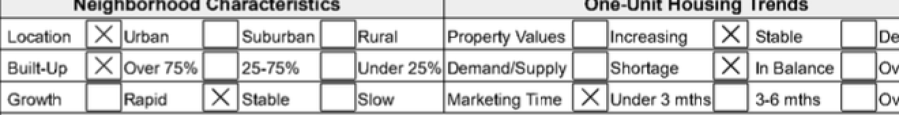
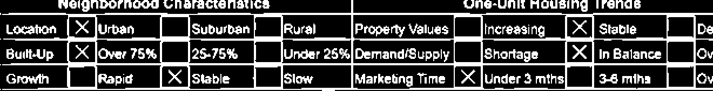
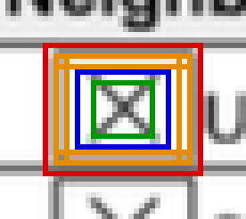
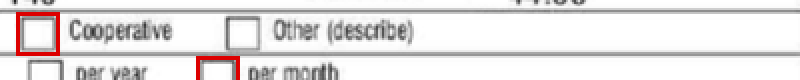
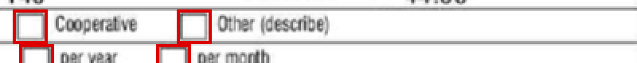
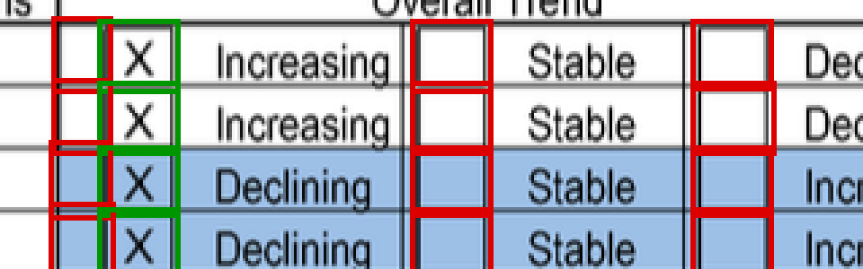
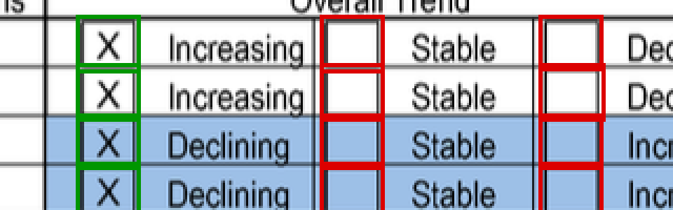
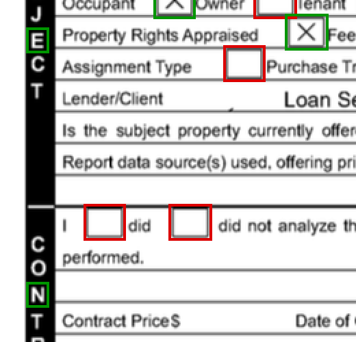

# How a checkbox is found

What happens to a page between arriving at `POST /detect` and coming back as
a list of boxes. Every figure is drawn by the detector itself from a committed
fixture, so none of it can drift from the code:

```sh
make docs      # go test -tags docs -run TestGenerateDocImages ./...
```

The before-and-after pairs in the second half switch one gate off through its
`Detector` field, which is why every threshold is a field, not a constant.

## Two paths, and why the interesting one is the hard one

A PDF that carries real AcroForm widgets already knows its own answers, and
those are read straight out of the form fields: exact, field name included,
and confidence `1` when the response is asked for in detail. Nothing below
applies to it.

Everything else — an image upload, or a flattened or scanned PDF, which is
what an appraisal report actually is — has no answers to read. It has pixels.
`pdftoppm` rasterizes each page at 300 DPI and the pixel detector takes over.

## The page as it arrives



Three rows of a neighbourhood section: twelve checkboxes, six of them marked
with an X, on a ruled table, surrounded by body text at the same scale as the
boxes. Everything that makes the problem hard is in this strip.

## Step 1 — decide what counts as ink

A scan has no true black and white. Thresholding is **adaptive**: a pixel is
ink if it is darker than its own neighbourhood, which is what makes uneven
lighting across a photographed page survivable without tuning per image.

The margin — how much darker is darker enough — is **measured, not fixed**. It
is `2.5 ×` the page's estimated noise, bounded to 10-30 grey levels, where the
noise is the mean absolute difference between the page and a blurred copy of
itself. Grainy scans measure 10-18 levels of noise and keep the full margin
they need to ignore paper grain; soft, low-contrast scans measure about 4 and
get a margin they can actually clear.

That matters more than it sounds. On one scan the fixed 30-level margin was
larger than the contrast between a grey box border and the paper around it:
the borders came out dashed, edge coverage fell to 0.21 on boxes that were
otherwise perfect squares, and a row of nine checkboxes reported none at all.



The detector actually keeps **two** masks. Shapes come from the margin the
page's noise calls for; the ink *inside* a box is always judged at the full
margin. A soft margin turns the blurred fringe of a border into ink, and on a
box near the minimum size that fringe fills the interior and the box reads as
marked. On a grainy page the two masks are identical and nothing changes.

## Step 2 — every contour, not just the promising ones


**348 contours** in this strip alone. Letters, table rules, cell corners, the
X marks, and — somewhere in there — twelve checkboxes. This is the actual
problem: not "find the squares" but "reject 336 things that are not squares
without rejecting the twelve that are".

Contours are retrieved as a flat list rather than a tree, deliberately, so
that **holes come back too**. An unchecked box encloses a hole, and a hole is
a contour in its own right, so a box is still found when its border is welded
to a table rule and its outer contour is lost into the grid.

## Step 3 — is this shape a checkbox?

Each contour is fitted with a polygon and put through a series of gates. The
key decision is to look for **quadrilaterals, not square-ish blobs of ink**:
`D` and `o` are as square as a checkbox and have hollow middles, but neither
fits a four-sided shape.

The polygon is fitted to the contour's **convex hull**, not the raw contour. A
real mark overflows its box — a bold X pokes out past the border at the
corners — and the raw outline then detours around each spike and stops being a
quadrilateral: seven corners on one otherwise perfect 37x37 square. A hull
ignores spikes and nicks.



On this box, marked with an X:

| colour | what it is | measured here |
| --- | --- | --- |
| red | the bounding box | 26x21px |
| amber | the four bands `edgeCoverage` reduces | weakest side **1.00** |
| blue | the wide interior window | **0.20** ink |
| green | the central interior window | **0.38** ink |

- **Edge coverage** is the fraction of each side carrying ink near it, taking
  the weakest of the four. A convex hull is blind to what is missing from the
  middle of a side, and blocky capitals like `H`, `E` and `N` have perfectly
  rectangular hulls — this is the gate that keeps them out.
- **The interior windows** are what decides marked or not. They are inset past
  the *measured* border, not by a fixed fraction: on a box near the minimum
  size a 3px stroke is more than 15% of the side, and a window that still
  contains the border reads an empty box at 0.36 ink and calls it marked. The
  wide window exists for scratchy marks whose ink sits in the corners and
  leaves the middle nearly empty.
- **Size** is bounded below by 12px — below that anti-aliasing fills a box's
  interior and there is nothing left to measure — and above by the larger of
  120px and 6% of the page's short edge, so a scan at 600 DPI is not thrown
  out for having boxes that are physically normal.

What survives is deduplicated (a box's outline and its own hole are the same
box seen twice, so near-concentric pairs collapse) and sorted into reading
order, grouped into rows so a few pixels of skew do not scramble a line.


Eighteen detections in this crop — the twelve checkboxes plus six more from
the columns continuing past the right edge — green for marked, red for empty.

## How the failures were actually found

None of the gates above were designed up front. Each one is a bug that a real
page exposed, and the sequence is the interesting part of the work.

### A perfect square that fitted a pentagon




A page scanned at about 150 DPI reported 39 of its ~118 boxes. The ones it
dropped measured squareness 1.00, rectangularity 0.87 and edge coverage 1.00 —
a checkbox by every measure — and were thrown out for having **five corners**.

The polygon tolerance was 2% of the contour's perimeter, which on a 16px box
is 1.3px. A rasterized edge wanders about a pixel either way, so the tolerance
was finer than the image's own precision and every rounded corner became an
extra vertex.

Two fixes, because loosening the tolerance alone is not safe: a floor of 2px
on the tolerance, and a rule that a five-cornered hull is accepted when its
rectangularity reaches 0.90. A curve cannot clear that bar — rectangularity is
exactly what a bold `D` fails — while simply raising the tolerance to 3px put
a page of prose back to reporting checkboxes.

**46 → 69 detections on that page**, with the false-positive canaries
unchanged at zero.

### Ruled cells that look exactly like checkboxes




A ruled table cell is a rectangle with a complete border and a clean interior.
By shape there is nothing to tell it from a checkbox, and on this page a narrow
cell sits beside every single box. All 13 were reported.

Squareness does not separate them — this page's real boxes measure 0.84-0.88
and its cells 0.74-0.79, but on another page the real boxes drop to 0.77 and
the cells reach 0.75, and the ranges touch. Neither does the ink around them:
cells 0.20-0.36, real boxes 0.05-0.45, fully overlapping.

What does separate them is that **a printed form draws every checkbox at one
size**, so a page with enough boxes says what a box measures on it. A
candidate whose width or height is far from the page's median is a cell.

The tolerance is deliberately **lopsided** — 15% below the median, 25% above —
and that asymmetry is the whole trick. A mark overflows its box, so a measured
rectangle can come out larger than the printed one but never smaller. On one
page the four widest boxes, 33-35px against a median of 29, turned out to be
exactly its four marked ones. A symmetric tolerance wide enough to keep those
was also wide enough to keep the cells.

**61 → 48 detections**, which is exactly the number of checkboxes on the page.

### Letters that are not on paper




An appraisal form labels its sections with a word set vertically down the
margin, white letters knocked out of a solid black band. The counters of `E`
and `N` are neat little rectangles, and the detector reported ten of them on
one page — all of them *marked*, since everything around them is ink.

The fix is the observation the figure makes obvious: **a checkbox sits on
paper**. If the band around a candidate is more than 60% inked, it is not on
paper at all. Real boxes measure 0.07-0.26 there; lettering cut out of a
banner measures close to 1.

Worth being honest about this one: on today's fixtures the size prior already
catches these letters, because they are also far off the page's box size, so
this check no longer changes any measured result on its own. It is kept
because it works on pages too sparse for the size prior — which needs ten
boxes before it trusts a median — and because the two use independent signals.

## What it still gets wrong

- **Boxes welded to a table rule.** When a border runs into the grid, the
  outer contour becomes the whole table and the box is found only by its
  interior hole. A *marked* box has that hole broken up by the mark, so it can
  be missed entirely. This is the largest remaining gap: on one page it is why
  roughly a third of the marked boxes go unreported.
- **Four ruled cells on one page** sit 23% above its median size while another
  page's real marked boxes reach 21% above. Two points of margin is not enough
  to act on.
- **Confidence is not calibrated.** It ranks candidates sensibly but it is a
  hand-weighted blend, not a probability. With labelled pages it should be
  fitted.
- **Skew.** A rotated box still fits a quadrilateral, but its bounding box no
  longer matches it, so rectangularity drops and the box is lost. Deskewing
  from the page's long lines would fix it.
- **No ground truth.** The numbers above are counted by eye against real
  pages. They are regression floors, not a measured precision and recall.
